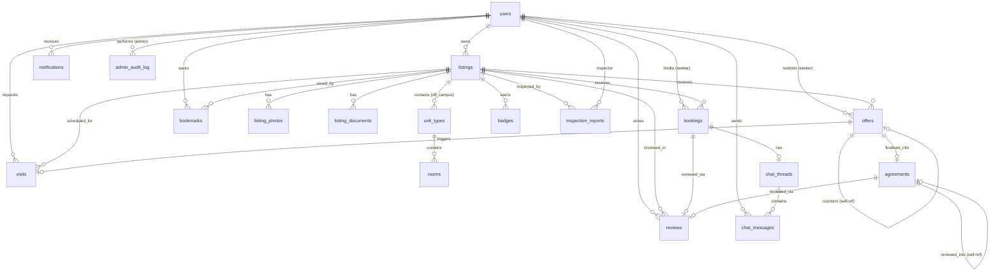

# BeeBop v2 — Database Schema Overview

> **Database**: PostgreSQL (via `asyncpg`) &nbsp;|&nbsp; **ORM**: SQLAlchemy 2.x async &nbsp;|&nbsp; **Migrations**: Alembic
> **Source**: [app/models/](file:///c:/Users/enaic/OneDrive/Desktop/miyata/BeeBop-v2/backend/app/models/__init__.py)

---

## Entity-Relationship Diagram



---

## Shared Mixins

All models extend `Base` (SQLAlchemy `DeclarativeBase`) plus these mixins from [_mixins.py](file:///c:/Users/enaic/OneDrive/Desktop/miyata/BeeBop-v2/backend/app/models/_mixins.py):

| Mixin | Columns Added |
|---|---|
| **UUIDPrimaryKeyMixin** | `id` — `UUID(as_uuid=True)`, PK, default `uuid4` |
| **TimestampMixin** | `created_at` — `DateTime(tz)`, server_default `now()` |
| | `updated_at` — `DateTime(tz)`, server_default `now()`, auto-updates on change |

> [!NOTE]
> Every table below inherits `id`, `created_at`, `updated_at` — they are **not repeated** in the column lists.

---

## Enums

Defined in [_enums.py](file:///c:/Users/enaic/OneDrive/Desktop/miyata/BeeBop-v2/backend/app/models/_enums.py). All are Python `StrEnum` stored as native PostgreSQL enums.

| Enum | Values |
|---|---|
| `UserRole` | `seeker`, `landlord`, `agent`, `inspector`, `trusted_agent`, `admin` |
| `AccountType` | `individual`, `agency` |
| `ListingCategory` | `off_campus`, `short_let`, `rent`, `sales` |
| `ListingStatus` | `draft`, `under_doc_review`, `live_unverified`, `doc_verified`, `fully_verified`, `let_agreed`, `sale_agreed`, `suspended`, `delisted` |
| `BadgeType` | `document`, `physical` |
| `BadgeStatus` | `active`, `revoked`, `expired` |
| `OfferStatus` | `pending`, `accepted`, `rejected`, `countered`, `expired`, `withdrawn` |
| `AgreementStatus` | `draft`, `partial_signed`, `pending_payment`, `signed`, `active`, `expired`, `terminated` |
| `AgreementType` | `tenancy`, `sale` |
| `Gender` | `female`, `male`, `any` |
| `UnitKind` | `single_room`, `two_in_a_room`, `three_in_a_room`, `self_contain`, `custom` |
| `BedStatus` | `occupied`, `available`, `vacating` |
| `BookingStatus` | `requested`, `confirmed`, `cancelled`, `completed` |
| `VisitStatus` | `pending_assignment`, `agent_assigned`, `scheduled`, `report_pending`, `completed`, `cancelled`, `report_queried` |
| `VisitReportOutcome` | `approved`, `queried`, `flagged` |
| `VisitCancelledBy` | `seeker`, `landlord`, `agent`, `admin` |
| `InspectionReportStatus` | `assigned`, `in_progress`, `pending`, `approved`, `queried`, `rejected` |
| `NotificationChannel` | `email`, `whatsapp`, `in_app` |
| `NotificationStatus` | `queued`, `sent`, `delivered`, `failed` |

---

## Tables by Domain

### 1. Identity

#### `users`
**File**: [user.py](file:///c:/Users/enaic/OneDrive/Desktop/miyata/BeeBop-v2/backend/app/models/user.py)
**Purpose**: All platform users — seekers, landlords, agents, inspectors, trusted agents, admins.

| Column | Type | Nullable | Notes |
|---|---|---|---|
| `email` | `String(255)` | ✗ | Unique, indexed |
| `password_hash` | `String(255)` | ✓ | Optional PBKDF2-SHA256 password hash |
| `role` | `Enum(UserRole)` | ✗ | |
| `first_name` | `String(100)` | ✓ | |
| `last_name` | `String(100)` | ✓ | |
| `phone` | `String(32)` | ✓ | |
| `account_type` | `Enum(AccountType)` | ✓ | Landlord/agent only |
| `nin` | `String(11)` | ✓ | NIN number (cleared after verification) |
| `nin_verified` | `Boolean` | ✗ | default `false` |
| `nin_document_url` | `String(500)` | ✓ | Cloudinary URL for ID doc upload |
| `nin_document_uploaded_at` | `DateTime(tz)` | ✓ | |
| `nin_review_note` | `Text` | ✓ | Admin rejection reason |
| `bvn_verified` | `Boolean` | ✗ | default `false` |
| `date_of_birth` | `Date` | ✓ | |
| `business_name` | `String(255)` | ✓ | Agency only |
| `cac_number` | `String(32)` | ✓ | Agency only |
| `cac_verified` | `Boolean` | ✗ | default `false` |
| `agency_logo_url` | `String(500)` | ✓ | |
| `profile_photo_url` | `String(500)` | ✓ | |
| `bio` | `String(1000)` | ✓ | |
| `operating_area` | `String(255)` | ✓ | |
| `category_preferences` | `JSONB` | ✓ | Array of ListingCategory values |
| `institution` | `String(255)` | ✓ | Student seekers |
| `academic_level` | `String(64)` | ✓ | |
| `gender` | `Enum(Gender)` | ✓ | |
| `is_active` | `Boolean` | ✗ | default `true` |
| `is_suspended` | `Boolean` | ✗ | default `false` |
| `conduct_acknowledged_at` | `DateTime(tz)` | ✓ | Inspector/trusted agent activation |

**Relationships**: `listings` → `Listing[]` (back_populates `owner`)

---

### 2. Listings & Inventory

#### `listings`
**File**: [listing.py](file:///c:/Users/enaic/OneDrive/Desktop/miyata/BeeBop-v2/backend/app/models/listing.py)
**Purpose**: Unified listing model across all four categories.

| Column | Type | Nullable | Notes |
|---|---|---|---|
| `owner_id` | `UUID → users.id` | ✗ | FK, ondelete RESTRICT, indexed |
| `category` | `Enum(ListingCategory)` | ✗ | Indexed |
| `status` | `Enum(ListingStatus)` | ✗ | default `draft`, indexed |
| `title` | `String(200)` | ✓ | Draft-friendly nullable |
| `subtitle` | `String(300)` | ✓ | |
| `description` | `Text` | ✓ | |
| `address_line` | `String(500)` | ✓ | Exact address (revealed post-offer) |
| `district` | `String(100)` | ✓ | Indexed — primary search facet |
| `gps_lat` | `Float` | ✓ | |
| `gps_lng` | `Float` | ✓ | |
| `amenities` | `JSONB` | ✗ | Structured checklist (see below) |
| `price` | `Numeric(14,2)` | ✓ | Rent=annual, Short-let=nightly, Sales=total, Off-campus=NULL |
| `type_data` | `JSONB` | ✗ | Category-specific fields (see below) |
| `view_count` | `Integer` | ✗ | default 0 |
| `save_count` | `Integer` | ✗ | default 0 |
| `enquiry_count` | `Integer` | ✗ | default 0 |
| `suspended_at` | `DateTime(tz)` | ✓ | |
| `suspension_reason` | `Text` | ✓ | |
| `deleted_at` | `DateTime(tz)` | ✓ | Soft-delete |
| `review_note` | `Text` | ✓ | Admin doc-review note |

**Relationships**:
- `owner` → `User`
- `photos` → `ListingPhoto[]` (cascade `all, delete-orphan`)
- `documents` → `ListingDocument[]` (cascade `all, delete-orphan`)

##### `amenities` JSONB shape
```json
{
  "power":    { "generator": {"present": true, "confirmed": false}, ... },
  "water":    { "borehole": ..., "running_water": ..., "water_treatment": ..., "tank": ... },
  "security": { "gated_estate": ..., "cctv": ..., "perimeter_fence": ..., "security_guards": ... },
  "internet": { "fibre_available": ..., "wifi_included": ... },
  "parking":  { "private_parking": ..., "shared_parking": ..., "gated_parking": ... },
  "kitchen":  { "fitted_cabinets": ..., "gas_cooker": ..., "fridge": ..., "microwave": ... },
  "laundry":  { "washing_machine": ..., "dryer": ..., "external_line": ... }
}
```

##### `type_data` JSONB by category

| Category | Fields |
|---|---|
| **rent** | `bedroom_count`, `property_type` (flat/detached/semi_detached/terraced/bq/mini_flat/self_contain), `furnishing`, `payment_structure`, `available_from` |
| **sales** | `bedroom_count`, `property_type` (flat/detached/semi_detached/terraced/land_only/commercial), `development_status`, `title_type` |
| **short_let** | `base_rate`, `weekend_rate`, `min_stay_nights`, `turnaround_days`, `instant_booking` |
| **off_campus** | `institutions_accepted` (string array) |

---

#### `listing_photos`
**File**: [listing.py](file:///c:/Users/enaic/OneDrive/Desktop/miyata/BeeBop-v2/backend/app/models/listing.py#L94-L108)

| Column | Type | Nullable | Notes |
|---|---|---|---|
| `listing_id` | `UUID → listings.id` | ✗ | FK CASCADE, indexed |
| `url` | `String(500)` | ✗ | Cloudinary / dev-assets URL |
| `room_label` | `String(100)` | ✓ | "Living Room", "Bedroom", etc. |
| `is_cover` | `Boolean` | ✗ | default `false` |
| `display_order` | `Integer` | ✗ | default 0, ordered by |
| `is_inspector_walkthrough` | `Boolean` | ✗ | default `false` |

---

#### `listing_documents`
**File**: [listing.py](file:///c:/Users/enaic/OneDrive/Desktop/miyata/BeeBop-v2/backend/app/models/listing.py#L111-L133)

| Column | Type | Nullable | Notes |
|---|---|---|---|
| `listing_id` | `UUID → listings.id` | ✗ | FK CASCADE, indexed |
| `s3_key` | `String(500)` | ✗ | Private S3 bucket |
| `filename` | `String(300)` | ✗ | |
| `content_type` | `String(100)` | ✗ | pdf/jpeg/png |
| `doc_type` | `String(64)` | ✗ | c_of_o, deed_of_assignment, governors_consent, tenancy_agreement, receipt, other |
| `size_bytes` | `Integer` | ✓ | |

---

#### `listing_amenities`
**File**: [listing.py](file:///c:/Users/enaic/OneDrive/Desktop/miyata/BeeBop-v2/backend/app/models/listing.py#L136-L147)
**Purpose**: Placeholder — amenities currently live in `listings.amenities` JSONB. Reserved for future relational migration.

---

#### `unit_types` (off-campus only)
**File**: [student_accommodation.py](file:///c:/Users/enaic/OneDrive/Desktop/miyata/BeeBop-v2/backend/app/models/student_accommodation.py#L19-L32)

| Column | Type | Nullable | Notes |
|---|---|---|---|
| `listing_id` | `UUID → listings.id` | ✗ | FK CASCADE, indexed |
| `name` | `String(100)` | ✗ | e.g. "Self-contain (en-suite)" |
| `kind` | `Enum(UnitKind)` | ✗ | single_room, two_in_a_room, three_in_a_room, self_contain, custom |
| `beds_per_room` | `Integer` | ✗ | |
| `total_units` | `Integer` | ✗ | |

**Relationships**: `rooms` → `Room[]` (cascade `all, delete-orphan`)

---

#### `rooms` (off-campus only)
**File**: [student_accommodation.py](file:///c:/Users/enaic/OneDrive/Desktop/miyata/BeeBop-v2/backend/app/models/student_accommodation.py#L35-L63)

| Column | Type | Nullable | Notes |
|---|---|---|---|
| `unit_type_id` | `UUID → unit_types.id` | ✗ | FK CASCADE, indexed |
| `name` | `String(100)` | ✗ | "Block A — Room 01" |
| `gender_tag` | `Enum(Gender)` | ✗ | Self-contain uses `ANY` |
| `beds_total` | `Integer` | ✗ | |
| `beds_available` | `Integer` | ✗ | |
| `bed_status_summary` | `Enum(BedStatus)` | ✗ | default `available` |

**Constraints**: `CHECK (beds_available >= 0 AND beds_available <= beds_total)`

---

### 3. Transactions

#### `offers`
**File**: [offer.py](file:///c:/Users/enaic/OneDrive/Desktop/miyata/BeeBop-v2/backend/app/models/offer.py)
**Purpose**: Rent, student, and sales offers. Short-let uses `bookings` instead.

| Column | Type | Nullable | Notes |
|---|---|---|---|
| `listing_id` | `UUID → listings.id` | ✗ | FK CASCADE, indexed |
| `seeker_id` | `UUID → users.id` | ✗ | FK RESTRICT, indexed |
| `price` | `Numeric(14,2)` | ✗ | |
| `move_in_date` | `Date` | ✓ | |
| `conditions` | `Text` | ✓ | |
| `status` | `Enum(OfferStatus)` | ✗ | default `pending`, indexed |
| `parent_offer_id` | `UUID → offers.id` | ✓ | Self-ref for counter-offers |
| `round_number` | `Integer` | ✗ | default 1, max 3 |
| `awaiting_landlord_response` | `Boolean` | ✗ | default `true` |
| `requires_visit_before_acceptance` | `Boolean` | ✗ | default `true` |
| `expires_at` | `DateTime(tz)` | ✗ | 48-hour deadline, indexed |
| `responded_at` | `DateTime(tz)` | ✓ | |
| `expiry_notifications_sent` | `JSONB` | ✗ | `{"h0": true, "h24": true, ...}` |

---

#### `agreements`
**File**: [agreement.py](file:///c:/Users/enaic/OneDrive/Desktop/miyata/BeeBop-v2/backend/app/models/agreement.py)
**Purpose**: Tenancy (rent/student) and sale agreements — OTP-signed, PDF-rendered.

| Column | Type | Nullable | Notes |
|---|---|---|---|
| `listing_id` | `UUID → listings.id` | ✗ | FK RESTRICT, indexed |
| `offer_id` | `UUID → offers.id` | ✗ | FK RESTRICT, indexed |
| `type` | `Enum(AgreementType)` | ✗ | tenancy or sale |
| `status` | `Enum(AgreementStatus)` | ✗ | default `draft`, indexed |
| `signatures` | `JSONB` | ✗ | Array of `{party, channel, signed_at, ip_hash}` |
| `pdf_s3_key` | `String(500)` | ✓ | S3 presigned URL |
| `start_date` | `Date` | ✓ | |
| `end_date` | `Date` | ✓ | Rent/student only |
| `rendered_data` | `JSONB` | ✗ | Pre-filled data for PDF + audit |
| `sales_invoice_reference` | `String(200)` | ✓ | Paystack (sales only) |
| `sales_invoice_due_at` | `DateTime(tz)` | ✓ | |
| `landlord_fee_total` | `Numeric(14,2)` | ✓ | |
| `seeker_fee_total` | `Numeric(14,2)` | ✓ | |
| `seller_fee_total` | `Numeric(14,2)` | ✓ | |
| `facilitation_fee_total` | `Numeric(14,2)` | ✓ | |
| `landlord_payment_reference` | `String(200)` | ✓ | |
| `seeker_payment_reference` | `String(200)` | ✓ | |
| `paystack_reference` | `String(200)` | ✓ | |
| `payment_confirmed_at` | `DateTime(tz)` | ✓ | |
| `renewed_into_id` | `UUID → agreements.id` | ✓ | Self-ref for renewals |
| `renewal_prompted_at` | `DateTime(tz)` | ✓ | |

---

#### `bookings` (short-let only)
**File**: [booking.py](file:///c:/Users/enaic/OneDrive/Desktop/miyata/BeeBop-v2/backend/app/models/booking.py)
**Purpose**: Short-let reservations — replaces the offer flow for this category.

| Column | Type | Nullable | Notes |
|---|---|---|---|
| `listing_id` | `UUID → listings.id` | ✗ | FK CASCADE, indexed |
| `seeker_id` | `UUID → users.id` | ✗ | FK RESTRICT, indexed |
| `check_in` | `Date` | ✗ | |
| `check_out` | `Date` | ✗ | |
| `guest_count` | `Integer` | ✗ | default 1 |
| `status` | `Enum(BookingStatus)` | ✗ | default `requested`, indexed |
| `instant_booking` | `Boolean` | ✗ | default `false` |
| `base_total` | `Numeric(14,2)` | ✗ | |
| `weekend_uplift` | `Numeric(14,2)` | ✗ | default 0 |
| `seeker_fee` | `Numeric(14,2)` | ✗ | default 0 |
| `host_fee` | `Numeric(14,2)` | ✗ | default 0 |
| `grand_total` | `Numeric(14,2)` | ✗ | |
| `paystack_reference` | `String(200)` | ✓ | |
| `payment_confirmed_at` | `DateTime(tz)` | ✓ | |
| `decided_at` | `DateTime(tz)` | ✓ | |
| `decision_deadline` | `DateTime(tz)` | ✓ | |
| `decline_reason` | `Text` | ✓ | |
| `access_details` | `Text` | ✓ | Released on check-in day |
| `access_details_released_at` | `DateTime(tz)` | ✓ | |
| `checked_in_at` | `DateTime(tz)` | ✓ | |
| `payout_at` | `DateTime(tz)` | ✓ | |
| `payout_amount` | `Numeric(14,2)` | ✓ | |
| `payout_reference` | `String(200)` | ✓ | |
| `cancelled_at` | `DateTime(tz)` | ✓ | |
| `cancellation_reason` | `Text` | ✓ | |

---

### 4. Verification & Visits

#### `badges`
**File**: [badge.py](file:///c:/Users/enaic/OneDrive/Desktop/miyata/BeeBop-v2/backend/app/models/badge.py)
**Purpose**: Document and physical verification badges per listing. Both present = "Fully Verified".

| Column | Type | Nullable | Notes |
|---|---|---|---|
| `listing_id` | `UUID → listings.id` | ✗ | FK CASCADE, indexed |
| `type` | `Enum(BadgeType)` | ✗ | document or physical |
| `status` | `Enum(BadgeStatus)` | ✗ | default `active` |
| `issued_by_id` | `UUID → users.id` | ✗ | FK RESTRICT |
| `inspector_id` | `UUID → users.id` | ✓ | FK SET NULL (physical badges) |
| `expires_at` | `DateTime(tz)` | ✗ | Doc=24mo, Physical=12mo |
| `revoked_at` | `DateTime(tz)` | ✓ | |
| `revocation_reason` | `Text` | ✓ | |

---

#### `inspection_reports`
**File**: [inspection.py](file:///c:/Users/enaic/OneDrive/Desktop/miyata/BeeBop-v2/backend/app/models/inspection.py)
**Purpose**: Physical inspection reports filled by inspectors, reviewed by admin.

| Column | Type | Nullable | Notes |
|---|---|---|---|
| `listing_id` | `UUID → listings.id` | ✗ | FK CASCADE, indexed |
| `inspector_id` | `UUID → users.id` | ✗ | FK RESTRICT, indexed |
| `status` | `Enum(InspectionReportStatus)` | ✗ | default `assigned`, indexed |
| `assessment` | `JSONB` | ✗ | Structured checklist payload |
| `evidence` | `JSONB` | ✗ | Array of S3 keys with GPS/timestamp metadata |
| `visit_gps_lat` | `Float` | ✓ | Exact GPS captured during visit |
| `visit_gps_lng` | `Float` | ✓ | |
| `inspector_note` | `Text` | ✓ | |
| `submitted_at` | `DateTime(tz)` | ✓ | Locks edits |
| `assigned_by_id` | `UUID → users.id` | ✓ | FK SET NULL |
| `assigned_at` | `DateTime(tz)` | ✓ | |
| `reviewed_by_id` | `UUID → users.id` | ✓ | FK SET NULL |
| `reviewed_at` | `DateTime(tz)` | ✓ | |
| `review_note` | `Text` | ✓ | |

---

#### `area_scores`
**File**: [inspection.py](file:///c:/Users/enaic/OneDrive/Desktop/miyata/BeeBop-v2/backend/app/models/inspection.py#L66-L93)
**Purpose**: Per-geographic-cell infrastructure scores (shared across listings in the same area).

| Column | Type | Nullable | Notes |
|---|---|---|---|
| `cell_lat` | `Float` | ✗ | Grid cell anchor, indexed |
| `cell_lng` | `Float` | ✗ | Grid cell anchor, indexed |
| `road_condition` | `Integer` | ✓ | 1–5 score |
| `electricity_supply_hours` | `Integer` | ✓ | Inspector-observed |
| `electricity_supply_hours_reported` | `Integer` | ✓ | Landlord-reported |
| `security` | `Integer` | ✓ | 1–5 score |
| `proximity` | `Integer` | ✓ | 1–5 score |
| `landmarks` | `JSONB` | ✗ | Nearest markets, hospitals, universities |
| `last_assessed_at` | `DateTime(tz)` | ✓ | |
| `source` | `String(32)` | ✓ | "inspection" or "admin_edit" |

---

#### `visits`
**File**: [visit.py](file:///c:/Users/enaic/OneDrive/Desktop/miyata/BeeBop-v2/backend/app/models/visit.py)
**Purpose**: Agent-led property visits triggered by accepted offers.

| Column | Type | Nullable | Notes |
|---|---|---|---|
| `listing_id` | `UUID → listings.id` | ✗ | FK CASCADE, indexed |
| `seeker_id` | `UUID → users.id` | ✗ | FK RESTRICT, indexed |
| `offer_id` | `UUID → offers.id` | ✓ | FK SET NULL |
| `status` | `Enum(VisitStatus)` | ✗ | default `pending_assignment`, indexed |
| `assigned_agent_id` | `UUID → users.id` | ✓ | FK SET NULL |
| `assigned_at` | `DateTime(tz)` | ✓ | |
| `assigned_by_id` | `UUID → users.id` | ✓ | FK SET NULL |
| `agent_confirmation_deadline` | `DateTime(tz)` | ✓ | 2-hour window |
| `agent_confirmed_at` | `DateTime(tz)` | ✓ | |
| `scheduled_at` | `DateTime(tz)` | ✓ | |
| `visit_report` | `JSONB` | ✓ | `{confirmation: {...}, observations: {...}}` |
| `visit_report_submitted_at` | `DateTime(tz)` | ✓ | |
| `visit_report_reviewed_at` | `DateTime(tz)` | ✓ | |
| `visit_report_reviewed_by_id` | `UUID → users.id` | ✓ | FK SET NULL |
| `visit_report_review_note` | `Text` | ✓ | |
| `cancelled_at` | `DateTime(tz)` | ✓ | |
| `cancellation_reason` | `Text` | ✓ | |
| `cancelled_by` | `Enum(VisitCancelledBy)` | ✓ | |
| `cancelled_by_user_id` | `UUID → users.id` | ✓ | FK SET NULL |

---

### 5. Communication & Engagement

#### `chat_threads`
**File**: [chat.py](file:///c:/Users/enaic/OneDrive/Desktop/miyata/BeeBop-v2/backend/app/models/chat.py)
**Purpose**: Short-let in-booking chat threads (seeker + host + moderator).

| Column | Type | Nullable | Notes |
|---|---|---|---|
| `booking_id` | `UUID → bookings.id` | ✗ | FK CASCADE, unique, indexed |
| `participant_ids` | `JSONB` | ✗ | Array of user UUIDs |

**Relationships**: `messages` → `ChatMessage[]` (cascade `all, delete-orphan`)

---

#### `chat_messages`
**File**: [chat.py](file:///c:/Users/enaic/OneDrive/Desktop/miyata/BeeBop-v2/backend/app/models/chat.py#L35-L61)

| Column | Type | Nullable | Notes |
|---|---|---|---|
| `thread_id` | `UUID → chat_threads.id` | ✗ | FK CASCADE, indexed |
| `sender_id` | `UUID → users.id` | ✗ | FK RESTRICT |
| `body` | `Text` | ✗ | |
| `flagged` | `Boolean` | ✗ | default `false`, indexed |
| `flag_patterns` | `JSONB` | ✗ | `["nigerian_phone", ...]` |
| `action_shortcut` | `String(64)` | ✓ | "extend_booking", "report_issue", etc. |
| `is_moderator_message` | `Boolean` | ✗ | default `false` |

---

#### `notifications`
**File**: [notification.py](file:///c:/Users/enaic/OneDrive/Desktop/miyata/BeeBop-v2/backend/app/models/notification.py)

| Column | Type | Nullable | Notes |
|---|---|---|---|
| `user_id` | `UUID → users.id` | ✗ | FK CASCADE, indexed |
| `event_type` | `String(100)` | ✗ | "offer.received", "agreement.ready_to_sign", etc. Indexed |
| `channel` | `Enum(NotificationChannel)` | ✗ | email, whatsapp, in_app |
| `status` | `Enum(NotificationStatus)` | ✗ | default `queued`, indexed |
| `payload` | `JSONB` | ✗ | Template name + variables |
| `read_at` | `DateTime(tz)` | ✓ | In-app read marker |
| `sent_at` | `DateTime(tz)` | ✓ | |
| `failure_reason` | `Text` | ✓ | |

---

#### `reviews`
**File**: [review.py](file:///c:/Users/enaic/OneDrive/Desktop/miyata/BeeBop-v2/backend/app/models/review.py)
**Purpose**: Gated to verified transactors. Short-let has sub-ratings; sales have none.

| Column | Type | Nullable | Notes |
|---|---|---|---|
| `listing_id` | `UUID → listings.id` | ✗ | FK CASCADE, indexed |
| `reviewer_id` | `UUID → users.id` | ✗ | FK RESTRICT, indexed |
| `booking_id` | `UUID → bookings.id` | ✓ | FK SET NULL (short-let) |
| `agreement_id` | `UUID → agreements.id` | ✓ | FK SET NULL (rent/student) |
| `overall_rating` | `Integer` | ✗ | CHECK 1–5 |
| `rating_accuracy` | `Integer` | ✓ | Short-let only |
| `rating_cleanliness` | `Integer` | ✓ | Short-let only |
| `rating_location` | `Integer` | ✓ | Short-let only |
| `rating_value` | `Integer` | ✓ | Short-let only |
| `body` | `Text` | ✓ | |

**Constraints**: `CHECK (overall_rating BETWEEN 1 AND 5)`

---

#### `bookmarks`
**File**: [bookmark.py](file:///c:/Users/enaic/OneDrive/Desktop/miyata/BeeBop-v2/backend/app/models/bookmark.py)

| Column | Type | Nullable | Notes |
|---|---|---|---|
| `user_id` | `UUID → users.id` | ✗ | FK CASCADE, indexed |
| `listing_id` | `UUID → listings.id` | ✗ | FK CASCADE, indexed |

**Constraints**: `UNIQUE(user_id, listing_id)`

---

### 6. Platform Administration

#### `admin_audit_log`
**File**: [audit_log.py](file:///c:/Users/enaic/OneDrive/Desktop/miyata/BeeBop-v2/backend/app/models/audit_log.py)
**Purpose**: Every admin-side mutation captured for accountability.

| Column | Type | Nullable | Notes |
|---|---|---|---|
| `admin_id` | `UUID → users.id` | ✗ | FK RESTRICT, indexed |
| `entity_type` | `String(64)` | ✗ | "listing", "user", etc. Indexed |
| `entity_id` | `UUID` | ✗ | Indexed |
| `action` | `String(64)` | ✗ | "doc.approve", "listing.suspend", etc. Indexed |
| `payload` | `JSONB` | ✗ | `{note, before, after}` |

---

## Summary Statistics

| Metric | Count |
|---|---|
| **Tables** | 18 |
| **PostgreSQL Enums** | 19 |
| **Foreign Key Relationships** | 30+ |
| **JSONB Columns** | 12 |
| **Indexed Columns** | 35+ |
| **Check Constraints** | 2 |
| **Unique Constraints** | 2 (users.email, bookmarks.user_id+listing_id) |

> [!TIP]
> The schema follows a **draft-friendly** pattern: most required-at-submission fields are nullable at the DB level to allow partial draft persistence. Validation of "ready to submit" happens in the service layer at submission time.
